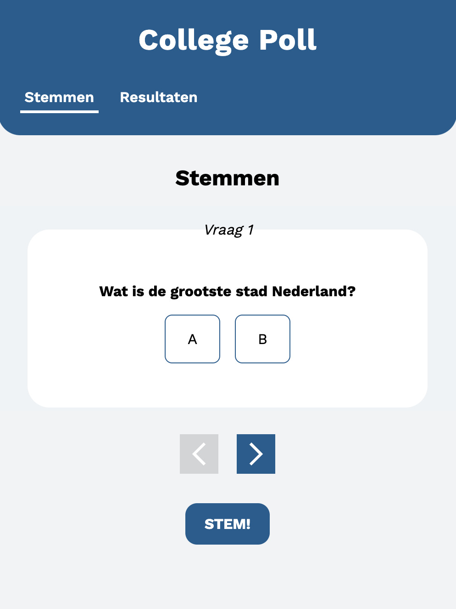
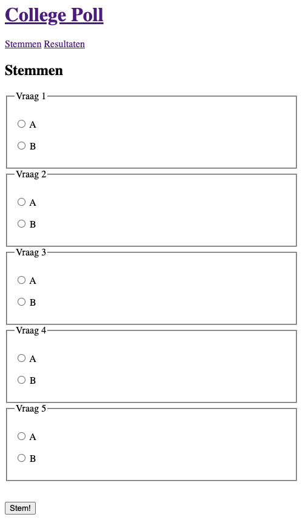
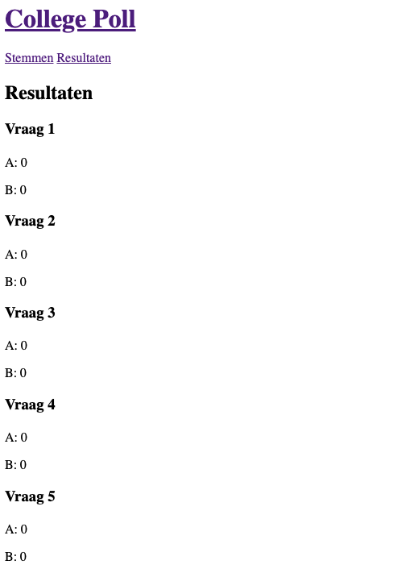
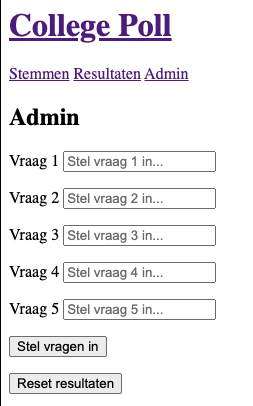
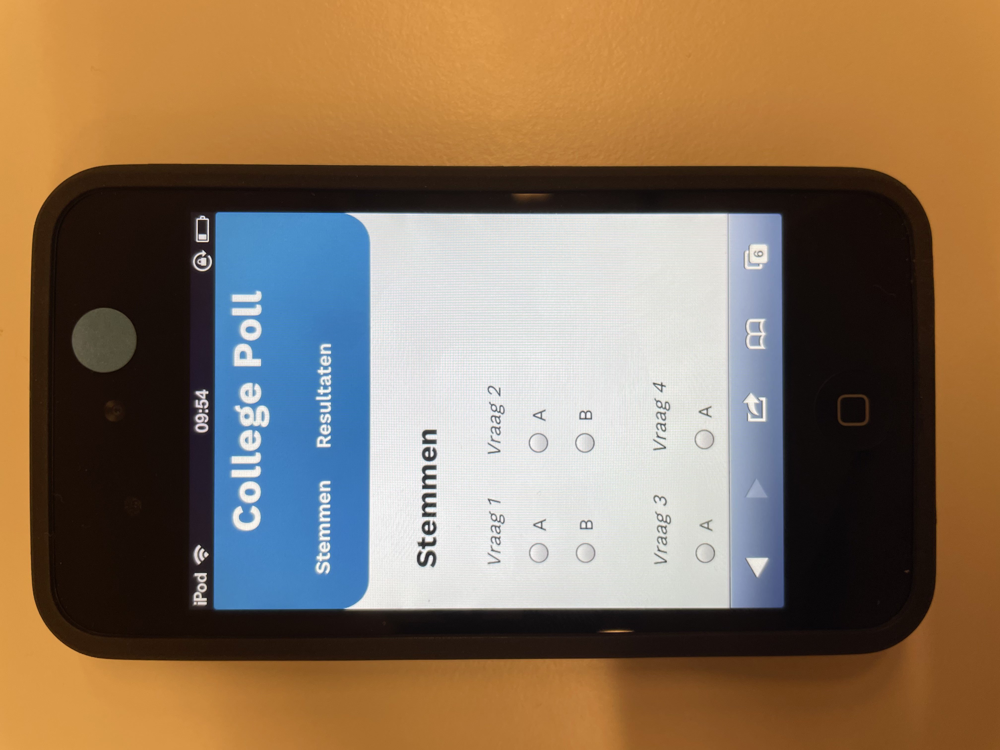
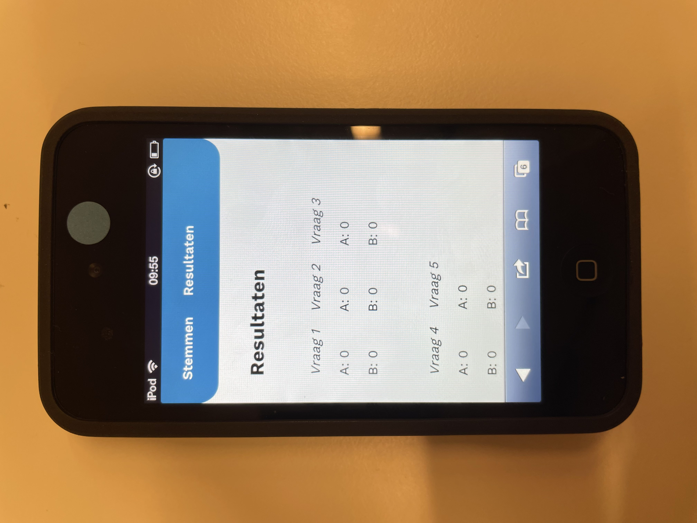
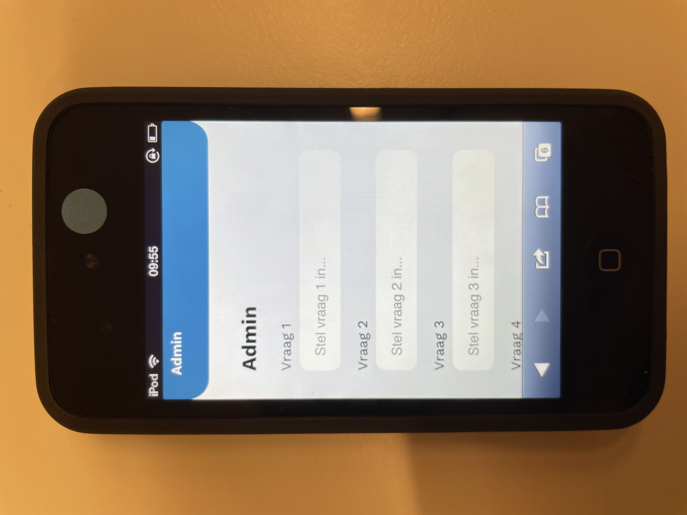

# 

## Table of contents
  - [Table of contents](#table-of-contents)
  - [About](#about)
  - [Features](#features)
  - [Activity Diagram](#Activity-Diagram)
  - [Installing](#installing)
  - [Author](#author)
  - [Contributing](#contributing)
  - [License](#license)

## [Live demo](https://college-poll.herokuapp.com/)


## About
**College Poll is een web applicatie waarmee je studenten tijdens een college een poll kunt voorleggen met vragen en antwoorden. Je kunt vervolgens de resultaten zien.**

Deze web app is gemaakt met Node/Express met server-side rendering. 



## Features
|                                               |     |
| --------------------------------------------- | --- |
| 🗳️  Stem op jouw keuze 					        | ✔   |
| 📊  Bekijk de resultaten                      | ✔   |
| ✏️  Pas de vragen aan in het *admin-panel.*   | ✔   |


## Wireframe


## Core functionaliteit
De core functionaliteit van de site is het maken en beantwoorden van een poll.
Ik vind dat deze basis functie altijd zo moeten werken.
Ik heb deze daarom met pure html gemaakt. Zo zou een browser deze altijd moeten kunnen gebruiken.
Het kan namelijk zijn dat sommige browsers elementen niet supporten of dat de bezoeker van je site CSS of JS heeft uitgezet. 

De site werkt dus in alle browsers door pure html:








## Browser Technologies / Progressive Enhancement
### Slider (JS) (if classlist)
Ik heb mij als eerst gefocused op het gedeelte waar je de poll invult. Hier zit wat mij betreft de belangrijkste interactie. Daarom heb ik deze als eerst progressive enhanced.

Er wordt gekeken of flex wordt ondersteund door CSS met:
```
@supports (display: flex) {}
```

Vervolgens in de JS wordt geconctroleerd of er .classList gebruikt kan worden
```
 if (document.body.classList) {}
```

### Font
Ik heb een fallback font 'Sans-serif' gedefinieerd zodat deze opgepakt wordt, als de browser het custom font niet laadt. 
```
font-family: 'Work Sans', sans-serif;
```

### Nav
Aan de navigatie wordt op de huidige pagina een CSS class megegeven met JS. Dit is een verbetering van de UX. Ook dit wordt gedaan met een .classList 
Deze wordt op beschikbaarheid gecheckt:
```
 if (document.body.classList) {}
```

### Main-tag
HTML is vergevingsgezind. De main tag wordt door oude browser niet gesupport doordat het een HTML5 element is.


### @Support
Zoals eerder beschreven wordt er gebruik gemaakt van @support om te checken of CSS een property begrijpt.

### Prefix
Ik heb voor mijn slider ook een prefix moeten gebruiken. op de IOS safari wordt de appearance van een input niet meteen aangepast daarvoor gebruik ik:
```
-webkit-appearance: none;
```

### Javascript uit
Als javascript uit staat valt de slider functie weg, maar is de site prima te gebruiken

## Browsers
Ik heb de app op deze 4 browsers / devices getest

### Chrome 100
- Ondersteunt alle functionaliteiten

### Safari
- Ondersteunt alle functionaliteiten
- Persoonlijk vind ik het geen fijne tab-functie

### Safari on IOS 15.3.1
- Ondersteunt CSS property `appearance` niet meteen, daarom: `-webkit-appearance: none;`
- Heeft geen mooie scroll transition op ID hashes
- Voor de rest ondersteunt deze alles

### Android (Nexus 5)
- Ondersteunt alle functionaliteiten

### Safari on IOS 5.1
(Oude browser) 

- Ondersteunt geen ClassList
- Ondersteunt geen FlexBox









## Installing
Clone deze repository naar jouw lokale folder
```
git clone https://github.com/jornveltrop/College-Poll.git
```
<br>


## Author
De maker van deze app is: [*Jorn Veltrop*](https://github.com/jornveltrop)

## Contributing
Als je wilt bijdragen aan deze app kun je dat doen door middel van een [Issue](https://github.com/jornveltrop/College-Poll/issues).

## License
Dit project valt onder de MIT [license](https://github.com/jornveltrop/College-Poll/blob/main/LICENSE).